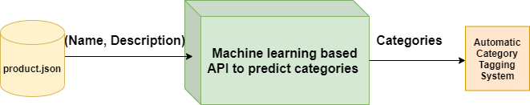
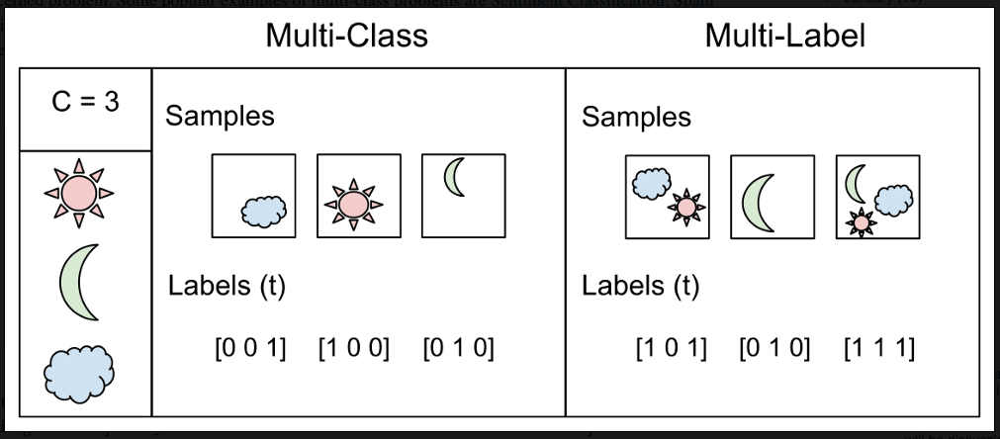
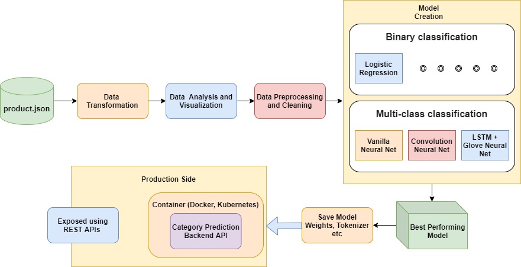

# Product Category Classifier

We aim to create a product category API that utilizes machine learning and deep learning to predict the possible categories/classes for any provided product name and its descriptions. The problem is considered for an e-commerce domain and the dataset used to train our models will contain some products and their labeled categories.

[Data](https://github.com/BestBuyAPIs/open-data-set)    
[Tutorial](https://prakhargurawa.medium.com/creating-an-e-commerce-product-category-classifier-using-deep-learning-part-1-36431a5fbc4e)

Stores JSON

    {"id":1000,"type":"BigBox","name":"Mall of America","address":"340 W Market","address2":"","city":"Bloomington","state":"MN","zip":"55425","location":{"lat":44.85466,"lon":-93.24565},"hours":"Mon: 10-9:30; Tue: 10-9:30; Wed: 10-9:30; Thurs: 10-9:30; Fri: 10-9:30; Sat: 10-9:30; Sun: 11-7","services":["Geek Squad Services","Best Buy Mobile","Best Buy For Business","Apple Shop","Hablamos Español","Camera Experience Shop ","Electronics Recycling","Magnolia Home Theater","Samsung Experience Shop","Windows Store"]},

Products JSON

    {"sku":43900,"name":"Duracell - AAA Batteries (4-Pack)","type":"HardGood","price":5.49,"upc":"041333424019","category":[{"id":"pcmcat312300050015","name":"Connected Home & Housewares"},{"id":"pcmcat248700050021","name":"Housewares"},{"id":"pcmcat303600050001","name":"Household Batteries"},{"id":"abcat0208002","name":"Alkaline Batteries"}],"shipping":5.49,"description":"Compatible with select electronic devices; AAA size; DURALOCK Power Preserve technology; 4-pack","manufacturer":"Duracell","model":"MN2400B4Z","url":"http://www.bestbuy.com/site/duracell-aaa-batteries-4-pack/43900.p?id=1051384074145&skuId=43900&cmp=RMXCC","image":"http://img.bbystatic.com/BestBuy_US/images/products/4390/43900_sa.jpg"},

## Multi-Class vs Multi-Label

Multi-Label Classification is a problem where the model is trained to predict multiple labels for a single input. 

Multi-Class Classification is a problem where the model is trained to predict a single label for a single input.

To solve multi-label problems, we mainly have approaches:

Binary classification: This strategy divides the problem into several independent binary classification tasks. It resembles the one-vs-rest method, but each classifier deals with a single label, which means the algorithm assumes they are mutually exclusive.

Multi-class classification: The labels are combined into one big binary classifier called powerset. For instance, having the targets A, B, and C, with 0 or 1 as outputs, we have A B C -> [0 1 0], while the binary classification transformation treats it as A B C -> [0] [1] [0].

Binary Classification

We will first use the Binary classification technique, which has been also explained above. In the below, you can see how we are creating a separate classifier for a separate product category, in machine learning this technique is called one-vs-all. We have used a simple linear regression model as a single product classification model. Other models worth trying are Naive Bayes, SVC, Random Forest.

